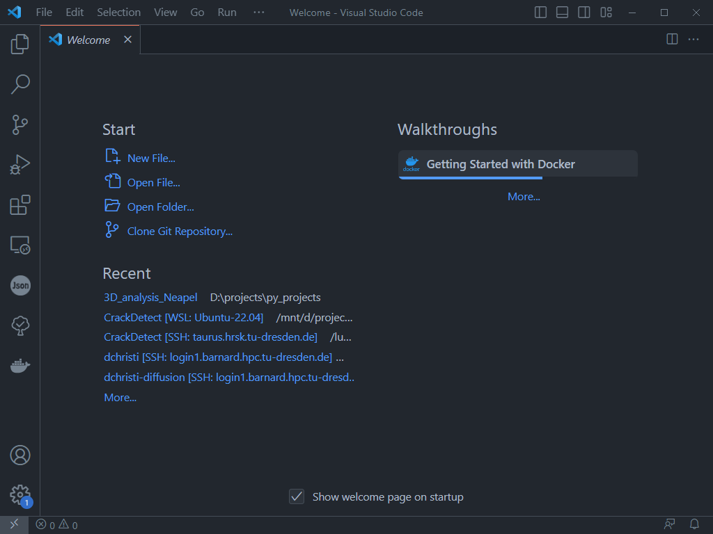

## Installation

### Python

download a current version of [Python](https://www.python.org/downloads/) and follow the stehs of installation

Verify the installation with the following command in Win-CMD or PowerShell

```ps
python --version
```

in macOS or linux you can use also

```bash
which python
```
to get the whole root path of your current python distribution 

### VS-Code

I highly recommend VS-Code for using Python and Jupyter Notebook. You can download it [here](https://code.visualstudio.com/)




### Git

- [GitHub App (user friendly)](https://desktop.github.com/)
- [Git (heavy command line)](https://git-scm.com/download/win)


### Code
clone this reporistory by downloading the `*.zip` file or by terminal

```ps
git clone 
```
(git has to be installed on your machine)

### Packages

create a virtual enviroment `<.venv>` with

```ps
python -m venv <.venv>
```

activate the enviroment (windows powershell)
```ps
.venv/Scripts/Activate.ps1
```
recommended to upgrade pip
```ps
python -m pip install --upgrade pip
```

Install all recommended packages with the following command:
```ps
python -m pip install -r requirements.txt
```
activate the jupyter-notebook kernel
```ps
python3 -m ipykernel install --user --name my-kernel --display-name="<my kernel>"
```

## Skript / Notebook

Select the note book and activate the Jupyter Kernel


Run the code

